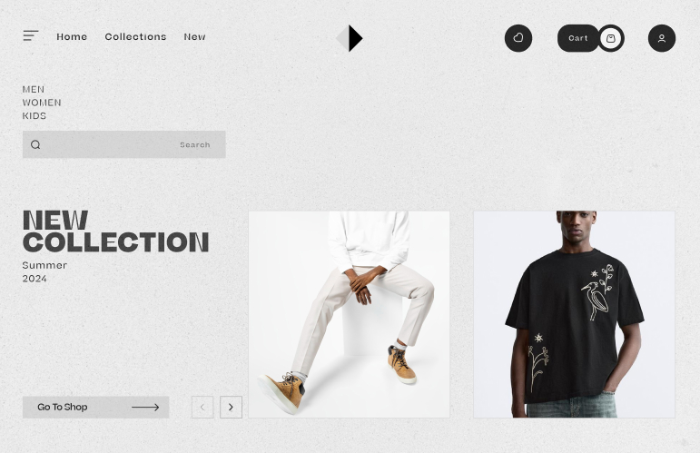

<<<<<<< HEAD
# e-commerce-website-nuxt
=======
# 🛍️ Nuxt 3 E-Commerce Website

A modern, high-performance e-commerce website built with [Nuxt 3](https://nuxt.com/), featuring a stylish homepage, dynamic product collections, detailed product pages, shopping cart, wishlist, user account management, and a seamless checkout experience.

<p align="center">
  
</p>

## 🚀 Features

- **Homepage**: Showcases new collections and featured products.
- **Product Listings**: Displays products by collection with filtering and sorting options.
- **Product Details**: Provides comprehensive information, including images, descriptions, and pricing.
- **Shopping Cart**: Allows users to add, remove, and manage products before checkout.
- **Wishlist**: Enables users to save products for future reference.
- **User Account**: Offers registration, login, and profile management functionalities.
- **Checkout Process**: Facilitates a secure and user-friendly checkout experience.
- **Responsive Design**: Optimized for various devices and screen sizes.
- **Performance Optimizations**: Utilizes Nuxt 3 features for fast loading and smooth navigation.

## 🛠️ Tech Stack

- **Framework**: [Nuxt 3](https://nuxt.com/) (Vue 3)
- **Styling**: [Tailwind CSS](https://tailwindcss.com/)
- **State Management**: [Pinia](https://pinia.vuejs.org/)
- **Robustness**: [TypeScript](https://www.typescriptlang.org/docs/handbook/typescript-from-scratch.html)
- **Routing**: Nuxt 3 File-based Routing
- **Image Optimization**: [Nuxt Image Module](https://image.nuxtjs.org/)
- **Icons**: [NuxtIcons/Iconify](https://iconify.design/)
<!-- - **Payment Integration**: [Stripe](https://stripe.com/) or preferred payment gateway -->

## 📦 Installation

### 1. Clone the Repository

```bash
git clone https://github.com/your-username/nuxt3-ecommerce.git
cd nuxt3-ecommerce
```

### 2. Install Dependencies

```bash
npm install
# or
yarn install
# or
pnpm install
```

### 3. Run Development Server

```bash
npm run dev
# or
yarn dev
# or
pnpm dev
```

Visit http://localhost:3000 to view the application.

## 📄 License

This project is licensed under the [MIT License](./LICENSE) – © 2025 Magdi Khaled Kelany
>>>>>>> 4b4145f (chore: initial commit with full code setup)
